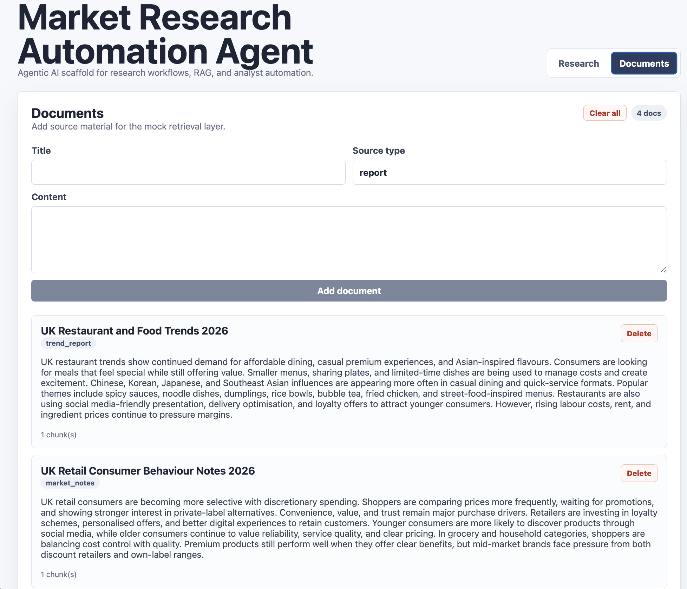
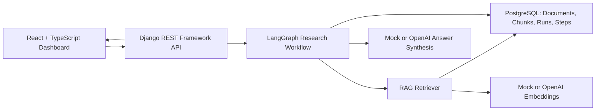
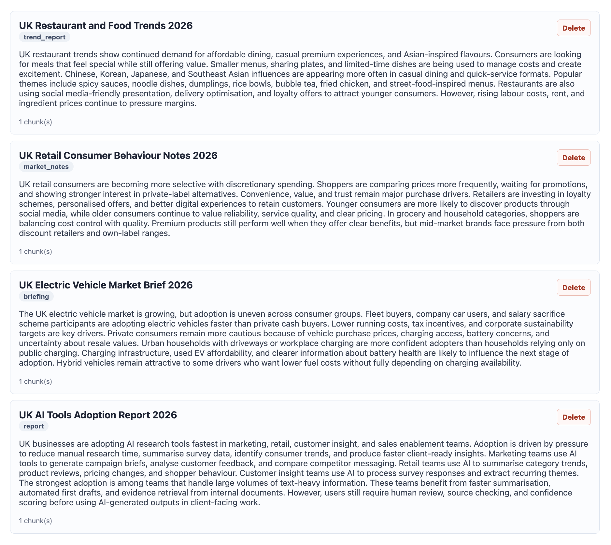
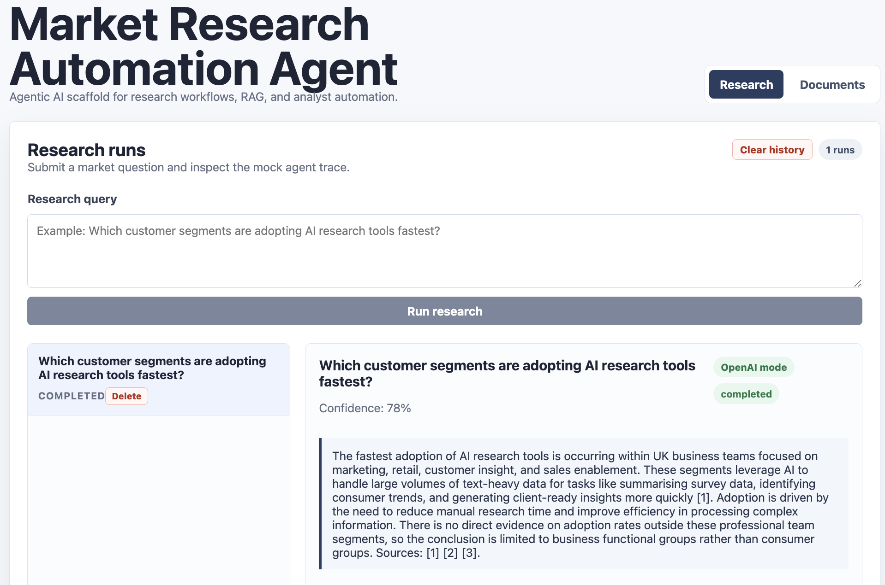
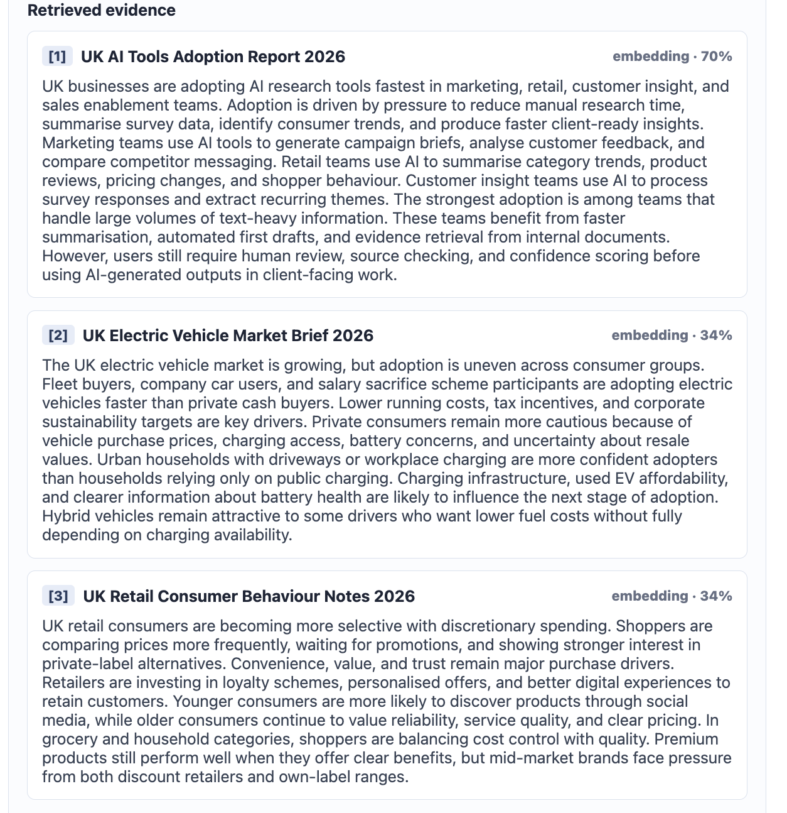
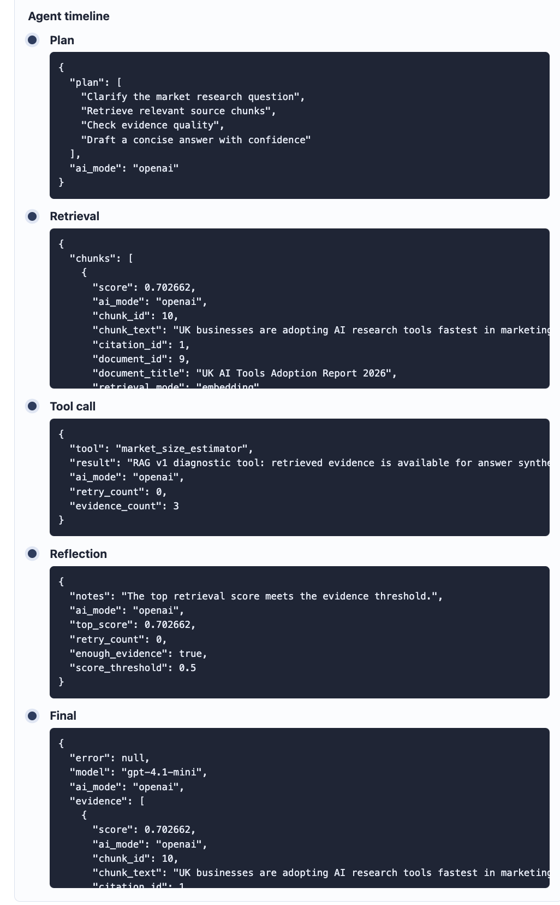
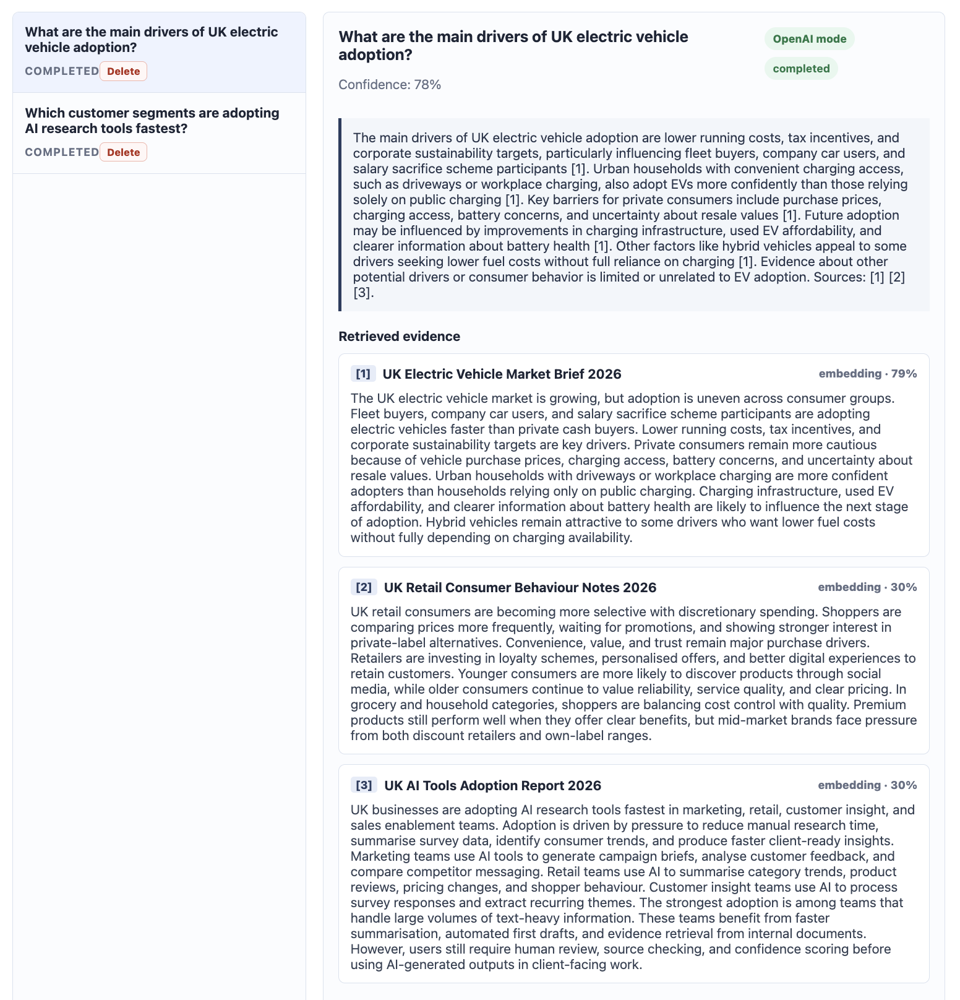
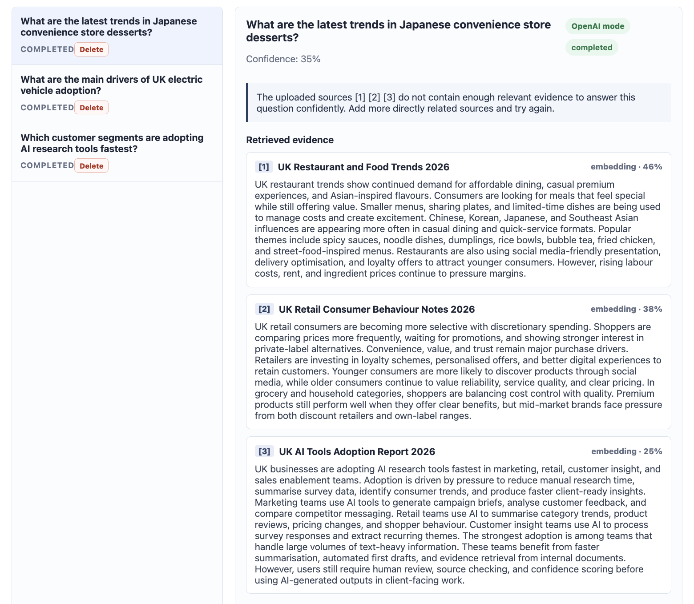
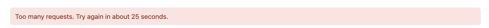

# Market Research Automation Agent

A working AI engineering portfolio demo for automated market research. The application combines a Django REST Framework backend, a React + TypeScript dashboard, PostgreSQL persistence, and LangGraph orchestration in an inspectable end-to-end research workflow.

Documents can be pasted or uploaded as TXT, Markdown, and text-based PDF files, then are chunked and embedded for RAG retrieval with keyword fallback when embeddings are unavailable. Research runs evaluate evidence quality, retry weak retrieval once, generate confidence-scored answers, attach structured citation markers, and preserve every agent step for review. OpenAI integration is optional, while deterministic mock mode keeps local development and public demos usable without API keys. The app also includes document and history management, retained-source cleanup, cascade deletion, and deployment-oriented API rate limiting.



## Key Features

- **LangGraph research workflow:** typed `plan`, `retrieve`, `tool_call`, `reflect`, and `final` nodes with conditional weak-evidence retry.
- **RAG document pipeline:** automatic chunking, deterministic or OpenAI embeddings, cosine-similarity ranking, and keyword fallback.
- **File ingestion:** synchronous TXT, Markdown, and text-based PDF extraction with retained originals, configurable size limits, and collision-safe storage.
- **Evidence quality controls:** a retrieval-score threshold, one refined-query retry, and distinct strong- and weak-evidence confidence scores.
- **Structured citations:** final answers use `[1]`, `[2]`, and `[3]` markers linked to ranked evidence cards and persisted source metadata.
- **Optional OpenAI integration:** OpenAI embeddings and answer synthesis when configured, with safe mock fallback if credentials or provider calls are unavailable.
- **Auditable research history:** every run, graph step, input, output, answer, confidence score, and diagnostic error is persisted.
- **Knowledge-base management:** paste or upload sources, inspect ingestion metadata, and delete or clear documents with cascading chunk and source-file cleanup.
- **Deployment safeguards:** scoped DRF throttling for expensive creation endpoints and friendly HTTP 429 handling in React.
- **Full-stack test coverage:** pytest for Django APIs and services, plus Vitest for dashboard workflows and error states.

## Architecture



The React dashboard sends document and research requests to Django REST Framework. Django persists domain records in PostgreSQL and invokes the synchronous LangGraph workflow. Retrieval ranks stored document chunks using embeddings or keyword fallback; the graph reflects on evidence quality, optionally retries, synthesizes an answer, and saves the complete trace before returning it to the UI.

## AI Modes

| Mode | Configuration | Behavior |
| --- | --- | --- |
| Mock mode | `AI_MOCK_MODE=true` | Uses deterministic local embeddings and mock answer synthesis. No API key or network model call is required. |
| OpenAI mode | `AI_MOCK_MODE=false` plus `OPENAI_API_KEY` | Uses the configured OpenAI embedding and language models while preserving the same RAG and LangGraph flow. |
| Automatic fallback | Missing key or failed final-answer call | Runs locally without a key, or falls back to mock final synthesis and records diagnostic metadata when an OpenAI answer call fails. |

## Demo Walkthrough

### 1. Dashboard Overview

The overview above shows the research workspace combining query submission, saved run history, AI-mode and completion badges, confidence scoring, cited answers, and clear-history controls in one dashboard.

### 2. Knowledge Base Documents

The Documents workspace accepts market source material, automatically creates embedded chunks, reports chunk counts, and supports individual deletion or clearing the full knowledge base.



### 3. Research Dashboard

A completed OpenAI-mode run shows the submitted question, persisted research history, confidence score, evidence-backed answer, and inline citation markers linked to the retrieved sources.



### 4. Cited Retrieved Evidence

Ranked evidence cards expose the citation label, source document, retrieval mode, similarity score, and exact chunk text used by the final answer.



### 5. Auditable LangGraph Timeline

Each graph node is saved as an `AgentStep`. The UI exposes the plan, retrieval output, tool call, reflection decision, and final synthesis payload for inspection.

<p align="center">
  
</p>

### 6. Strong-Evidence Result

When the top retrieval score meets the evidence threshold, the graph proceeds directly to synthesis and returns the normal 78% confidence result with cited supporting evidence.



### 7. Weak-Evidence Retry

When retrieved evidence remains below the threshold, LangGraph retries once with a refined query and then returns an explicit evidence-insufficiency message at 35% confidence.



### 8. Friendly Rate-Limit Handling

DRF throttling protects expensive creation endpoints, while the React error banner converts HTTP 429 responses into clear retry guidance.

<p align="center">
  
</p>

## AI Engineering Highlights

- **Agentic AI:** each research request creates a durable trace of agent steps, making orchestration visible and auditable.
- **LangGraph orchestration:** the research workflow runs through a typed graph with explicit planning, retrieval, tool, reflection, retry, and final-answer nodes.
- **RAG foundations:** documents are split into chunks, embeddings are stored, and retrieved evidence is shown in the UI.
- **Django and SQL:** the backend uses Django models, migrations, DRF serializers, viewsets, and PostgreSQL.
- **React:** the frontend provides a dashboard for query submission, cited answer inspection, agent timelines, and source document management.
- **DevOps:** Docker Compose runs PostgreSQL, Django, and Vite together for local development.

## Project Structure

```text
backend/
  config/                 Django project settings and URLs
  accounts/               Placeholder app for future auth
  documents/              Document ingestion, chunking, retrieval, models, and API
  research/               ResearchRun model and API
  agents/                 AgentStep model and LangGraph research workflow
frontend/
  src/                    React TypeScript app
docker-compose.yml
.env.example
README.md
```

## Local Setup

1. Copy environment defaults:

   ```bash
   cp .env.example .env
   ```

2. Start the stack:

   ```bash
   docker compose up --build
   ```

3. Open the app:

   - Frontend: <http://localhost:5173>
   - Backend API: <http://localhost:8000/api/>
   - Health check: <http://localhost:8000/api/health/>

## Environment Variables

| Variable | Default | Description |
| --- | --- | --- |
| `AI_MOCK_MODE` | `true` | When `true`, always use deterministic mock embeddings and mock final answers. |
| `OPENAI_API_KEY` | empty | Enables OpenAI mode only when `AI_MOCK_MODE=false`. |
| `OPENAI_LLM_MODEL` | `gpt-4.1-mini` | Model used for final-answer synthesis in OpenAI mode. |
| `OPENAI_EMBEDDING_MODEL` | `text-embedding-3-small` | Model used for chunk/query embeddings in OpenAI mode. |
| `VITE_API_BASE_URL` | `http://localhost:8000/api` | Frontend API base URL. |
| `API_ANON_RATE` | `120/min` | General anonymous API request limit. |
| `RESEARCH_RUN_CREATE_RATE` | `5/min` | Stricter limit for creating research runs. |
| `DOCUMENT_CREATE_RATE` | `20/min` | Limit for document creation. |
| `DOCUMENT_UPLOAD_MAX_BYTES` | `5242880` | Maximum uploaded document size in bytes (5 MB by default). |

Mock mode:

```env
AI_MOCK_MODE=true
OPENAI_API_KEY=
```

OpenAI mode:

```env
AI_MOCK_MODE=false
OPENAI_API_KEY=your-real-key
OPENAI_LLM_MODEL=gpt-4.1-mini
OPENAI_EMBEDDING_MODEL=text-embedding-3-small
```

If `AI_MOCK_MODE=false` but no key is present, the backend falls back to mock mode. If an OpenAI final-answer call fails, the app saves diagnostic metadata in the final agent step and falls back to a mock answer.

## File Ingestion

The Documents workspace supports two input paths:

- **Paste text:** manually enter a title, source type, and document content.
- **Upload file:** upload a UTF-8 `.txt`, UTF-8 `.md`, or text-based `.pdf` file.

The upload title is optional. A non-empty supplied title is used after trimming whitespace; otherwise the filename stem becomes the title. For example, `uk-ev-market-brief.pdf` becomes `uk-ev-market-brief`.

Uploads are processed synchronously. The backend validates the extension and configured size limit, extracts text, retains the original through collision-safe Django storage, and reuses the existing chunking and embedding pipeline. Uploaded originals are removed when their document is deleted or the knowledge base is cleared. The API exposes filename, type, size, and ingestion status metadata, but does not expose a source-file download URL.

PDF ingestion supports files that already contain extractable text. Scanned PDFs require OCR and are intentionally rejected in v1. Encrypted, malformed, empty, unsupported, oversized, or non-UTF-8 text files return validation errors without creating a document.

## Deployment Safety

DRF throttling protects normal API traffic and applies stricter limits to research-run and document creation. Rate-limited requests return HTTP `429` with a structured `rate_limited` response and retry timing where available.

For public portfolio demos, deploy with `AI_MOCK_MODE=true` by default. This prevents anonymous visitors from consuming paid OpenAI requests. Enable OpenAI mode only in a controlled environment with tighter rate limits, secret management, and monitoring.

## Backend Development

Run tests locally from `backend/` after installing Python dependencies:

```bash
python -m venv .venv
source .venv/bin/activate
pip install -r requirements.txt
pytest
```

The app uses PostgreSQL during normal runtime. The pytest configuration uses an in-memory SQLite database so API tests can run without a local Postgres service.

Backfill embeddings for existing chunks that still have empty embeddings:

```bash
python manage.py backfill_chunk_embeddings --dry-run
python manage.py backfill_chunk_embeddings
```

## Frontend Development

Run tests locally from `frontend/` after installing Node dependencies:

```bash
npm install
npm test
```

Start Vite without Docker:

```bash
npm run dev
```

## Continuous Integration

GitHub Actions runs independent backend and frontend checks for every pull request and for pushes to `main` or `v2`. The backend job uses Python 3.12, PostgreSQL 16 with pgvector available, mock AI mode, Django checks, migration drift detection, and pytest. The frontend job uses Node 20, installs the locked npm dependencies, runs Vitest in CI mode, and creates a production Vite build.

CI never requires an OpenAI API key and does not make real OpenAI calls or upload generated media.

## API Endpoints

| Method | Endpoint | Description |
| --- | --- | --- |
| GET | `/api/health/` | Service health check |
| GET | `/api/documents/` | List documents |
| POST | `/api/documents/` | Create a document, chunks, and chunk embeddings |
| POST | `/api/documents/upload/` | Upload a TXT, Markdown, or text-based PDF document using multipart form data |
| GET | `/api/documents/<id>/` | Retrieve one document |
| DELETE | `/api/documents/<id>/` | Delete one document and cascade-delete its chunks |
| DELETE | `/api/documents/clear/` | Delete all documents and chunks |
| GET | `/api/research-runs/` | List research runs |
| POST | `/api/research-runs/` | Create a research run and execute the RAG v1 agent |
| GET | `/api/research-runs/<id>/` | Retrieve one research run |
| DELETE | `/api/research-runs/<id>/` | Delete one research run and cascade-delete its agent steps |
| DELETE | `/api/research-runs/clear/` | Delete all research runs and agent steps |
| GET | `/api/research-runs/<id>/steps/` | List agent steps for a run |

Clear-all responses include `deleted` for top-level records, `deleted_rows` for all database rows including cascades, and `details` for Django's per-model delete breakdown.

## LangGraph Agent Flow

`POST /api/research-runs/` performs a synchronous RAG v1 workflow through LangGraph while keeping the Django API response shape stable:

1. Create a `ResearchRun` with status `running`.
2. Start a typed LangGraph state with the query, AI mode, retry count, retrieved chunks, reflection data, final answer fields, and errors.
3. Run the graph nodes in order: `plan`, `retrieve`, `tool_call`, `reflect`, and `final`.
4. After `reflect`, route conditionally:
   - a top retrieval score of at least `0.5` is enough evidence and goes directly to `final`
   - a score below `0.5` retries `retrieve` once with a refined query
   - weak evidence after one retry goes to `final` with `0.35` confidence and an explicit insufficiency notice
5. Save each node as an `AgentStep` record using the existing step types.
6. Assign citation IDs to retrieved chunks and create a final answer with OpenAI when enabled, otherwise mock synthesis.
7. Mark the run `completed`.

The orchestration entry point and graph definition live in `backend/agents/services/agent_runner.py`. Retrieval lives in `backend/documents/services/retriever.py`. Final answer synthesis remains in `backend/agents/services/llm_client.py`, so OpenAI failures still fall back to mock answers with diagnostic metadata saved in the final step.

### Citations

Retrieved chunks receive sequential numeric `citation_id` values in relevance order. Final answers reference those sources with markers such as `[1]` and `[2]`, and evidence cards display the same labels. The final `AgentStep.output_data` includes `sources_used`, with each source's citation ID, document title, chunk ID, score, and excerpt. No-evidence answers return an empty `sources_used` list and do not display invented citations.

## Manual Demo Script

1. Start the Docker stack and open <http://localhost:5173>.
2. Open **Documents**, switch to **Upload file**, and upload `ai-tools.txt`, `ev-market.md`, and `food-trends.txt`. Point out the filename, file type, completed status, automatic chunk count, and persisted knowledge-base cards.
3. Open **Research** and ask which teams are adopting AI research tools fastest, what drives UK EV adoption, and what trends are appearing in UK restaurants. Show that each answer retrieves evidence from the corresponding uploaded source.
4. Scroll through the agent timeline to demonstrate the saved plan, retrieval, tool call, reflection threshold, and final payload.
5. Submit an unrelated question. Show the second retrieval attempt, explicit insufficiency wording, and 35% confidence.
6. Submit research requests repeatedly to demonstrate the friendly rate-limit banner after the configured threshold.
7. Delete one uploaded document and confirm its retained source file is removed. Then use **Clear all** and **Clear history** to demonstrate confirmed file, chunk, and agent-step cleanup.

## pgvector Readiness

Docker Compose uses `pgvector/pgvector:pg16`. The current `DocumentChunk.embedding` field remains a JSONField for RAG v1. A future migration can enable the `vector` extension and replace the JSON placeholder with a vector column.

## Roadmap

- Enable pgvector similarity search with indexed vector columns.
- Add richer structure-aware chunking.
- Add OCR, URL ingestion, and asynchronous ingestion jobs.
- Add authentication and per-user research runs.
- Add LangGraph checkpointing or streaming when the workflow needs resumable or live-running agent traces.
- Add async execution with Celery, Django-Q, or a workflow runner.
- Deploy to Render, Fly.io, or Azure.

## CV-Ready Project Bullets

- Built a full-stack market research automation platform using Django REST Framework, React, TypeScript, PostgreSQL, Docker Compose, and LangGraph.
- Implemented TXT, Markdown, and text-based PDF ingestion with collision-safe retained storage, automatic chunking, deterministic/OpenAI embeddings, cosine-similarity retrieval, keyword fallback, evidence thresholds, retry routing, confidence scoring, and structured citations.
- Added optional OpenAI synthesis with mock-first fallback, persisted agent observability, cascade-safe data management, scoped API throttling, and automated pytest/Vitest coverage.
